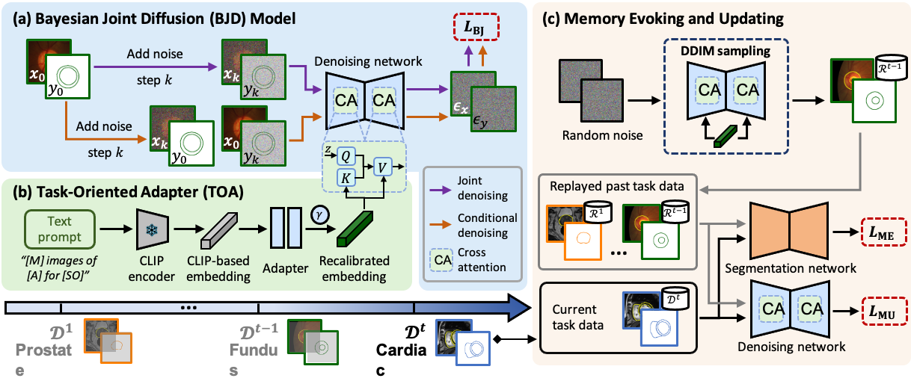

# Introduction
This repository is for our work submitted to MICCAI24, titled "Comprehensive Generative Replay for Task-Incremental Segmentation with Concurrent Appearance and Semantic Forgetting".
Specifically, we synthesize paired images and segmentation masks to simulate past task data, by employing a Bayesian Joint Diffusion (BJD) model to preserve image-mask correspondence, and equipping a Task-Oriented Adapter (TOA) on the prompt embedding to modulate the diffusion model for task-scalable data synthesis. When encountering new tasks, we leverage these replayed past task data to evoke faded memory, and update it to incorporate new task knowledge for future replays.

## Usage

### 1. Data Pre-processing
Data of three tasks: Cardiac, Fundus, Prostate can be downloaded from [Cardiac](https://www.ub.edu/mnms/), [Fundus](https://ieeexplore.ieee.org/document/9163289) and [Prostate](https://ieeexplore.ieee.org/document/9000851). The pre-processing pipeline of three tasks follows their works described in their papers.

### 2. Model Training
Firstly, run `train_bjdwithtoa.sh` to learn three tasks sequentially to simulate image-mask pair of each task. The training hyper-parameters can be set in the code. Notably, the pre-trained weights of CLIP text encoder can be downloaded from [CLIP text encoder](https://huggingface.co/stabilityai/stable-diffusion-2). Then, run `train_segnetwork.py` to update the segmentation network sequentially. Similarly, the training hyper-parameters can be set in the `options\base_options.py`. 
